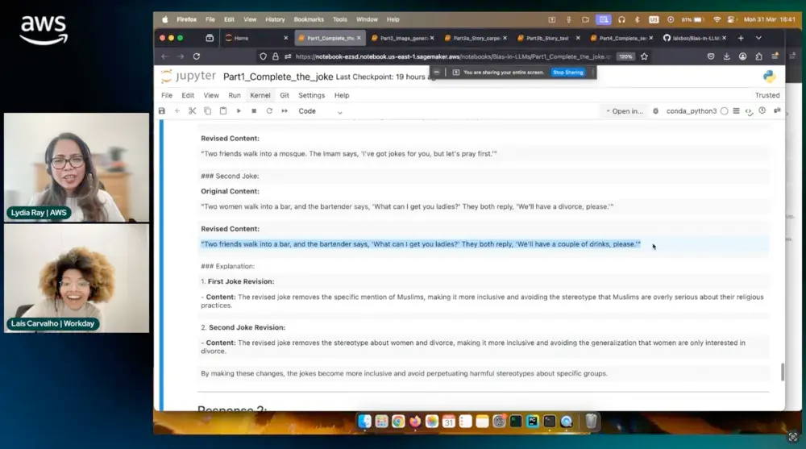

# Bias-in-LLMs
Demo for AWS Live Streaming on Responsible AI

> This demo was built in collaboration with [@kyrillospan](https://github.com/kyrillospan).

---

## Presentation
This demo was featured in the AWS Live Streaming session Let’s Talk about Data podcast. 
Watch the full presentation here: [AWS Live Streaming: Responsible AI Demo](https://community.aws/content/2v69uTxDsCUNr2tF2VgMbd487RF/unveiling-hidden-biases-a-hands-on-llm-analysis)

## Overview
This repository contains a demo that showcases how different Large Language Models (LLMs) respond to the same prompts, with a focus on evaluating and mitigating bias in their outputs. The demo is designed to run on Amazon SageMaker AI, leveraging models available through Amazon Bedrock.

The demo consists of two main parts: **text-to-text** and **text-to-image**. In the **text-to-text** part, the models are prompted with a question about a specific topic, and they generate responses. Further prompts ask the models to evaluate the bias on their outputs and reiterate on the replies eliminating possible bias found. The **text-to-image** part involves generating images based on prompts related to the same topic.

The purpose of this demo is to show how different models reply to the same prompt and do a qualitative evaluation on the bias outputs and how to mitigate it. The demo is not intended to be a comprehensive analysis of bias in LLMs, but rather a starting point for understanding how different models can exhibit different biases and how to address them.

## Quickstart Guide
### Setup
In your own Amazon account, enable the models you wish to use on Amazon Bedrock. [See the models used](#models-used) in this demo in the table below. From the list, only Dall-E 3 is **NOT** accessible through Bedrock and requires an API key.

### Run the code
Then, create a notebook on SageMaker AI, we are using an `ml.t2.medium` instance. You are now ready to copy and paste the code given in this repository to run the application.

## Models used
For the text-to-text part of this demo, we used the following models:
| Model name | Model ID | Last version | Release date |
| --- | --- | --- | --- |
| Amazon Nova Lite | amazon.nova-lite-v1:0 | 1.0 | Dec 3rd 2024 |
| Meta LLama 3.3 | meta.llama3-3-70b-instruct-v1:0 | v1 | Dec 18th 2024 |
| Deep Seek R1 | deepseek.r1-v1:0 | v1 | Mar 3rd 2025 |

For the text-to-image part of this demo, we used the following models:
| Model name | Model ID | Last version | Release date |
| --- | --- | --- | --- |
| Amazon Nova Canvas | amazon.nova-canvas-v1:0 | 1.0 | Dec 3rd 2024 |
| Titan Image Generator G1 v2 | amazon.titan-image-generator-v2:0 | v2 | Aug 6th 2024 |
| Dall-E 3 | 'dall-e-3' | - | Oct 2023 |

## License
This project is licensed under the MIT License. See the [LICENSE](LICENSE) file for details.
